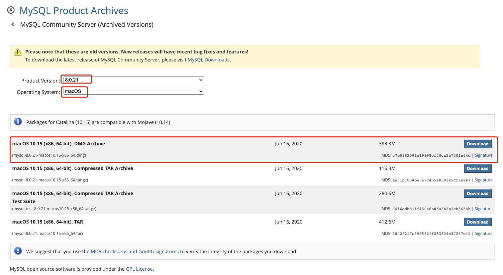

##  第一章 环境搭建

本章重点：
- 在电脑上安装MySQL数据库系统
- 安装客户端并连接到本机上的MySQL数据库
- 使用提供的脚本创建本教程所使用的示例数据库

具体安装方式请参考：
https://linklearner.com/datawhale-homepage/index.html#/learn/detail/70

### 1.下载mysql

下载地址：https://dev.mysql.com/downloads/
- windows操作系统选择：
    - 下载最新版本：`MySQL Installer for Windows`
    - 历史版本：选择最后的 `Download Archives` 后选择 `MySQL Installer` ,然后在新页面里选择所需历史版本的社区版。
    - 百度网盘：如果想使用的 MySQL 8.0.21.0, 也可以在百度⽹盘下载,
        - 下载链接：https://pan.baidu.com/s/1SOtMoVqqRXwa2qD0siHcIg  提取码：80lf
        - 备用下载链接：https://pan.baidu.com/s/1zK2vj50DvuAee-EqAcl-0A  提取码：80lf

- macOS 操作系统：
    - 最新版本：`MySQL Community Server`
    - 历史版本：`https://downloads.mysql.com/archives/community/`
    - 百度网盘：如果官网下载速度很慢, 或者希望下载本教程所使用的 MySQL 8.0.21.0, 也可以在百度⽹盘下载,
        - 下载链接：https://pan.baidu.com/s/1ka22UtzqFdOaIosrpKz92w  提取码: 8xh4
        - 备用下载链接：https://pan.baidu.com/s/1XeA_8PQvvRePEdZ5ayOT-Q  提取码：8xh4

我选择根参考文档同一个版本：




### 2.安装

不同环境有不同的安装方式，具体请参考：`https://linklearner.com/datawhale-homepage/index.html#/learn/detail/70`

在 mac 上直接双击dmg文件就可以开始安装了。

    如果数据库能够正确安装和配置，并且已经启动mysql服务器程序，就可以使用 `mysql -u root -p` 连接数据库啦！

### 3. 常用命令

连接数据库：mysql -u root -p    
退出数据库：exit

使用终端(或者windows下的命令行)与MySQL进行交互是非常便捷和高效的, 但是对于平时不怎么使用终端的普通人来说, 使用终端在做数据查询时, 在查询结果的显示和导出方面有诸多不便, 特别是当我们对 SQL 查询不熟练的时候, 这种方式很不利于我们进行查询语句的调试. 因此本教程将选择查询界面更加友好的客户端工具来连接数据库, 这种通过终端连接MySQL的方式暂时不再使用。

### 4.用 MySQL Workbench 连接 MySQL

MySQL Workbench 是一款功能强大的**数据库管理工具**, 它既可以用于设计数据库, 也可以用于连接数据库进行查询, 我们这个课程主要使用它的连接数据库进行查询的功能。

MySQL Workbench 是 MySQL 官方的客户端工具, 支持windows, macOS和Linux. 对于windows用户, 我们在安装 MySQL 的时候由于选择的是完整安装模式, 因此也同时安装了这个工具, 对于macOS的用户, 可以在https://dev.mysql.com/downloads/workbench/选择macOS版本进行下载安装. 

安装后，mac如果打不开该软件，请参考`https://blog.csdn.net/iiiliuyang/article/details/104186265`方法2.

### 5. mysql 总结
本章小结主要记录mysql软件包的安装和数据库管理工具MySQL Workbench的安装。


```python

```
